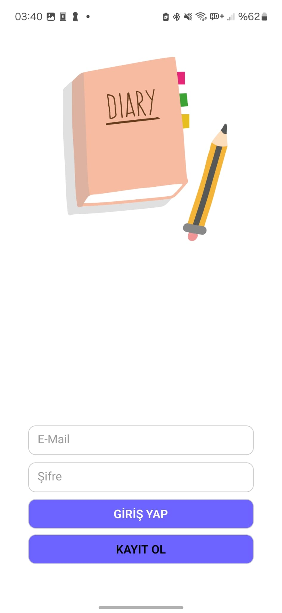
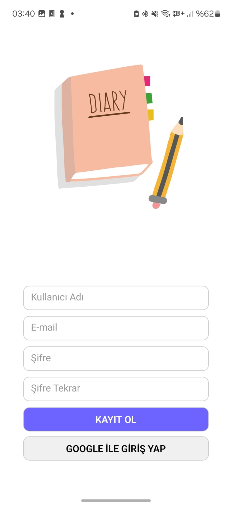
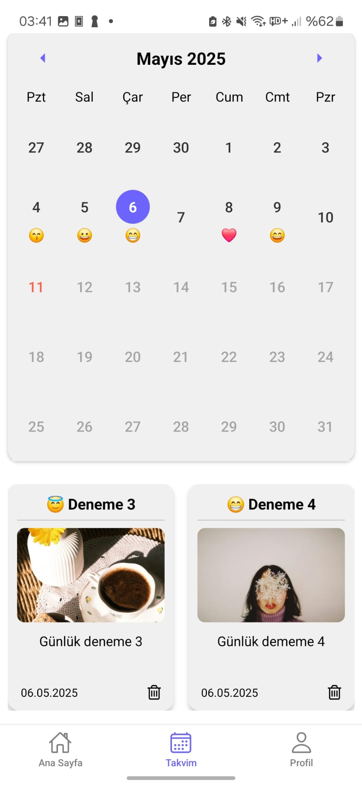
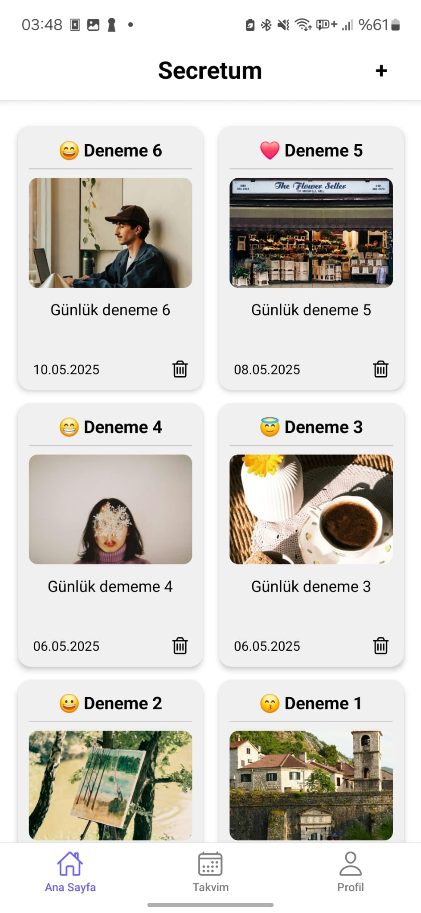
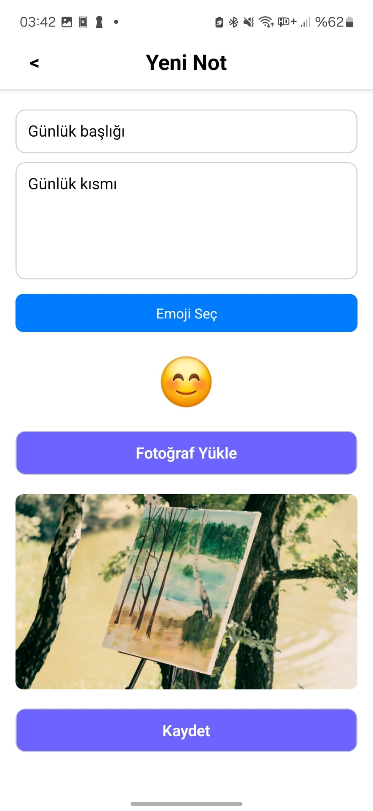
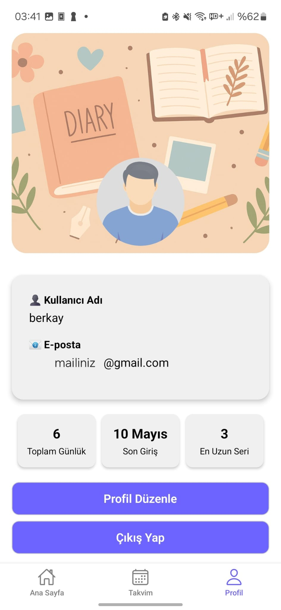

# Secretum 📓🔐

**Secretum**, kullanıcıların günlük tutmasını, her gününü bir emoji ile ifade etmesini ve görsel yükleyerek anılarını daha anlamlı hale getirmesini sağlayan bir mobil uygulamadır.

🛠️ Geliştirme Aşamasında  
🚀 React Native + Firebase ile geliştirilmiştir.

---

## 🎯 Amaç

- Her gün bir not (günlük) gir
- 📅 Takvim üzerinden notlara ulaş
- 😊 Emoji ile duygunu ifade et
- 📸 Fotoğraf yükle
- 🔐 Kendi hesabınla güvenli giriş yap

---

## 🧪 Özellikler

- ✅ Firebase Authentication (e-mail + parola ile giriş)
- ✅ Firestore ile not saklama
- 📝 Not başlığı, içeriği, emoji ve görsel desteği
- 📆 Takvim görünümünde notları tarih bazlı listeleme
- 🗑️ Günlük silme ve kullanıcı hesabı silme
- 📊 Kullanıcıya özel istatistikler (toplam gün, en uzun seri)
- 🎨 Koyu/açık tema desteği (dinamik)

---

## 🧩 Eklenecek Özellikler

- 🔄 **Google Authentication** desteği
- 🔒 **Günlükler sadece hesaba erişimi olan kullanıcıların erişebileceği şekilde depolanacak. Uygulama yapımcısı dahi kullanıcının günlüklerine erişemeyecek.**
- 🔒 **Gizlilik Modu:** Ana ekranda seçilen günlüklerin bulanık gösterilme seçeneği eklenecek, kullanıcı tıklayarak açabilecek
- 🎨 **UI İyileştirmeleri:** Arayüz görsel olarak iyileştirilecek, geçişler daha akıcı hale getirilecek
- 💬 **Duygu Analizi:** Günlüklerin **sadece emojileri** analiz edilerek kullanıcının ruh hali belirlenecek
- ✉️ **Motivasyon Mektupları:** Olumsuz duygu tespitinde uygulama kullanıcıya pozitif ve kişisel mesajlar sunacak

> 💡 **Not:** Tüm bu özellikler kullanıcı deneyimini geliştirmek ve kişisel refahı desteklemek için planlanmaktadır.

---

## 🖼️ Ekran Görüntüleri

### 🔐 Giriş & Kayıt Ekranı
Kullanıcılar kendi hesaplarıyla giriş yapabilir veya yeni kayıt oluşturabilir.

<p float="left">
  
  
</p>

---

### 📅 Takvim & Emoji İşaretleme
Takvim üzerinde not bırakılan günlerde seçilen emoji gösterilir. Tıklandığında o güne ait günlük görünür.



---

### 📓 Günlük Kartları (Ana Sayfa)
Son girilen günlükler kart halinde görüntülenir.



---

### ➕ Yeni Günlük Oluşturma
Günlük oluştururken başlık, içerik, emoji ve fotoğraf eklenebilir.



---

### 🧑 Profil & İstatistikler
Kullanıcı bilgileri, giriş tarihi ve günlük istatistikleri görüntülenebilir.



---

## 🧱 Kullanılan Teknolojiler

| Alan            | Teknoloji                    |
|-----------------|------------------------------|
| Mobil           | React Native (Expo)          |
| Navigasyon      | React Navigation             |
| UI Bileşenleri  | Custom component sistemi     |
| Firebase Auth   | Kullanıcı doğrulama          |
| Firestore       | Notların bulutta saklanması  |
| Takvim          | `react-native-calendars`     |
| Emoji           | `rn-emoji-keyboard`          |
| Fotoğraf Seçici | `expo-image-picker`          |
| Temalandırma    | `ThemeContext` + dark/light  |

---

## ⚙️ Kurulum

```bash
git clone https://github.com/Berkayilmz/secretum.git
cd secretum
npm install
npx expo start